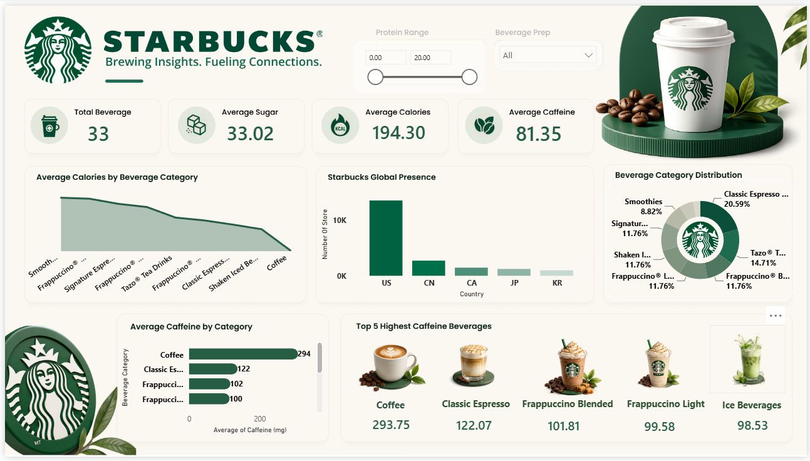

☕ Starbucks Power BI Dashboard

Interactive Starbucks Beverage & Business Insights Dashboard

An interactive Power BI dashboard created to analyze Starbucks beverage data and present key business and nutritional insights through an easy-to-understand visual report.

📊 Dashboard Preview

🎯 Project Objective

The objective of this project is to transform Starbucks beverage data into meaningful visual insights using Power BI, allowing users to explore beverage categories, nutritional metrics, caffeine levels, and Starbucks' global presence.

🔍 Key Insights

The dashboard provides analysis of:

- Total number of beverages
- Average sugar content
- Average calories
- Average caffeine content
- Average calories by beverage category
- Average caffeine by beverage category
- Beverage category distribution
- Starbucks global presence by country
- Top 5 beverages with the highest caffeine content
- Interactive filtering based on selected criteria

📈 Dashboard Features

- Interactive Power BI visuals
- KPI cards
- Category-wise analysis
- Caffeine and calorie analysis
- Beverage distribution
- Country-wise Starbucks presence
- Interactive filters
- Visual comparison of beverage categories
- Clean and user-friendly dashboard design

🛠️ Tools & Technologies

- Power BI – Dashboard development and visualization
- Microsoft Excel / CSV – Data source
- Data Cleaning – Data preparation and validation
- Data Visualization – Charts, KPIs and interactive visuals

## 📁 Repository Structure

    Starbucks-Power-BI-Dashboard/
    ├── Dashboard/
    │   ├── Starbucks_Dashboard.pbix
    │   └── Starbucks_Dashboard.png
    ├── Data/
    │   ├── starbucks.csv
    │   └── directory.csv
    ├── Image & Resources/
    │   ├── Classic Espresso.png
    │   ├── Frappuccino Blended coffee.png
    │   ├── Frappuccino Light Blended Coffee.png
    │   ├── Iced Beverages.png
    │   ├── coffee.png
    │   ├── dashboard-template.png
    │   └── logo.png
    └── README.md

🚀 How to Use

1. Download or clone this repository.
2. Open the "Dashboard" folder.
3. Open "Starbucks_Dashboard.pbix" using Microsoft Power BI Desktop.
4. Ensure the CSV files in the "Data" folder are available if Power BI asks for the data source.
5. Explore the interactive dashboard and filters.

📌 Project Highlights

This project demonstrates practical skills in:

- Data analysis
- Data cleaning
- Data visualization
- Dashboard development
- KPI creation
- Business reporting
- Power BI
- Working with CSV datasets

👨‍💻 Author

Sachin Kumar Sahu

Computer Science Graduate | Data Analytics Enthusiast

Skills: Python • SQL • Excel • Power BI • Tableau • Looker Studio
